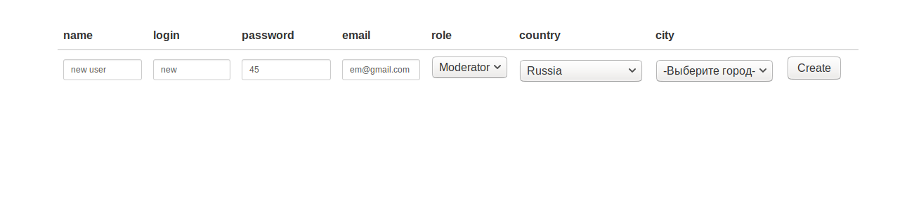

- убрать баг с городами при редактировании

# Servlet-JSP

В данном репозитории находится пример простого веб-приложения для 
добавления пользователей и хранения их в БД. 

_Используется :_

- Java
- Servlets
- JDBC + PostgreSQL
- JSP, JSTL 
- JSON + Jackson
- Mockito + Liquibase
- HTML, Bootstrap
- JavaScript, Ajax, JQuery

_Возможности приложения :_

По умолчанию в системе создается пользователь с логином root, пароль root. 
Root имеет возможность создавать, редактировать и удалять любого пользователя,
с определением ролей согласно иерархии (Admin, Moderator, User). 
После того как Root добавил нового пользователя и завершил работу с приложением, в системе
можно авторизоваться под новым пользователем.
User может редактировать только себя.
Moderator может редактировать себя и любого User.
Admin может редактировать себя и любого Moderator или User.

- Вывод на страницу всех пользователей из БД и их данных

- Авторизация пользователя по логину и паролю (Реализована через Servlet Filter).

- Добавление нового пользователя в систему с сохранением в БД

- Редактирование данных пользователя

- Удаление пользователя

_Установка и запуск :_

1. Загрузить с GitHub zip архив и распаковать его. Или склонировать 
репозиторий.
2. Установить Apache Tomcat и сконфигурировать его. Приложение 
тестировалось и отлаживалось с использованием контейнера Apache Tomcat 9.0.16.
3. Запустить и посмотреть работу приложение можно в IDE Intellij IDEA.
3. Для запуска приложения стартовая страница находится по адресу
http://localhost:8080/servlets , ее необходимо указать в конфигурации 
Apache Tomcat для IDE, или ввести вручную в строку браузера после запуска 
приложения.